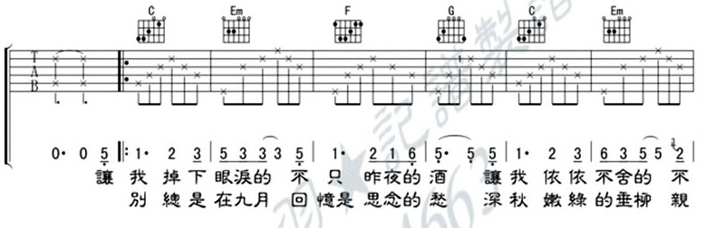

--- 
title: "Guitar bookdown"
author: "大鹏"
site: bookdown::bookdown_site
date: "`r Sys.Date()`"
description: "This is a collection of my favorite songs with guitar chords, produced by bookdown."
github-repo: "dapengde/boookdown-guitar"
cover-image: "images/cover.jpg"
url: 'https\://bookdown.org/baydap/bdguitar/'
documentclass: ctexbook
classoption: openany
colorlinks: no
lot: no
lof: no
geometry: [b5paper, tmargin=2.5cm, bmargin=2.5cm, lmargin=3.5cm, rmargin=2.5cm]
#cover-image: images/cover.jpg
---

# 前言 {#front .unnumbered} 

最真的梦，就是用R语言的bookdown把R代码、作图、数据分析和吉他谱弄到一起。

啥？弄到一起有什么用？

呃......容我清清脑子想一想......

>
> --- 大鹏
>

```{r, echo=5, out.width='60%'}
 z <- 2 * volcano        # Exaggerate the relief
 x <- 10 * (1:nrow(z))   # 10 meter spacing (S to N)
 y <- 10 * (1:ncol(z))   # 10 meter spacing (E to W)
 par(mar = c(0,0,0,0))
 persp(x, y, z, theta = 120, phi = 15, scale = FALSE, 
       axes = FALSE)
```

终会有\Am 一天　把心愿\Dm 完成　

带着你\F 飞奔\GM 找永\Cm 恒\Csthree \Cthree  

$$\int_0^\infty e^{-x^2} dx=\frac{\sqrt{\pi}}{2}$$
 
本书的吉他谱，在网页上看不见，只有点击下载pdf才能看见哦。

\mainmatter

# (PART) 用R bookdown记吉他谱 {#method .unnumbered} 

# 简介 {#intro .unnumbered}

前情提要：

- [用 R 语言的 bookdown 写书](http://dapengde.com/archives/19122)
- [用 R 语言的 bookdown 写诗集](http://dapengde.com/archives/19150)
- [用 R  语言的 bookdown 写学术论文](http://dapengde.com/archives/19190)
- [R 语言 bookdown 快速入门和语法速查](http://dapengde.com/archives/19141)

本篇说说如何用 R  语言的 bookdown 写吉他谱。别拦着我，让我陷进bookdown的怀抱里爽死吧。

中国的民谣吉他伴奏谱常见的一般是六线谱，格式是这样的：



- 第一行是和弦谱，包括和弦名称和左手按琴弦的指法图；
- 第二行是六线谱，右手拨弦的方式（当然也夹杂左手按和弦外音的变化）；
- 第三行是歌曲旋律的简谱；
- 第四行是歌词。

前两行的和弦谱和六线谱在录入时需要专业软件，太麻烦；歌曲旋律一般是跟着原唱学，基本用不着；歌词最容易录入。由于和弦谱最为重要，任何乐器伴奏都用得着，为了省事儿，上图可以只保留和弦名称和歌词，简化为文字谱：

      C    Em     F     G    C    Em
    让我掉下眼泪的不只昨夜的酒，让我依依不舍的不……

文字谱的好处是用不着任何专业软件，录入很方便。但是，这比较坑菜鸟。想不起来`Em`和弦的指法该怎么办？`Em`还好办，看见个`G#7sus4`，我崩溃了，自认水平不行，乖乖翻和弦字典去。如果标注了指法图——

让\CM 我掉下\Em 眼泪的　不\F 只昨夜的\GM 酒　让\CM 我依依\Em 不……

还是更方便一些，吉他和钢琴都可以用。我觉得等我老得掉光牙齿的时候，估计连C和弦的指法都忘光了，给孙子连个《成都》都唱不成，这时候指法图就有用了。

以前我玩过[LaTeX输入指法图](http://dapengde.com/archives/18230)的游戏。由于对LaTeX心怀恐惧，这个游戏没敢多玩。现在有了R语言的bookdown来取代LaTeX，自然想把这个游戏拿回来找找年轻的感觉。

这个主意早就有了，原以为会很麻烦（恐惧心理），一直没行动。昨天在送大娃和接二娃之间空出半个小时，鼓捣了一下，居然鼓捣出来了上面那个样子。其实很简单：用 bookdown 的壳，LaTeX的核。上面那句歌词，录入的文字是这样的：

    让\CM 我掉下\Em 眼泪的　不\F 只昨夜的\GM 酒　让\CM 我依依\Em 不舍的　不……

我打算以后陆陆续续把喜欢的歌弄成一本书，并且把bookdown录入吉他谱的源代码在[GitHub开了个bookdown-guitar的项目](https://github.com/dapengde/bookdown-guitar)。毕竟，中文的对齐不太完美，看看有没有高手来帮帮我。

其实跟LaTeX里一样。那我在LaTeX里用就行了，干嘛来bookdown里用？

因为这样的话，就可以在同一本书里同时呈现R代码、作图、分析结果和吉他谱啊。

啊？把他们弄在一起有什么用？

呃……这是个好问题……容我清清脑子想一想……听说数学领域很多理论在提出时都没啥用，后来都用上了，除了数论……我不会运气跟数论一样好吧……

# (PART) 最真的梦 {#true-dream .unnumbered} 

# 成都{#cd .unnumbered} 

作词：赵雷，作曲：赵雷，编曲：赵雷、喜子。


前奏：\iCM


让\CM 我掉下\Em 眼泪的　不\F 只昨夜的\GM 酒　

让\CM 我依依\Em 不舍的　不\F 只你的温\GM 柔

余\Em 路还要\Am 走多久　你\F 攥着\GM 我的\CM 手

让\Em 我感到\F 为难的　是\GM 挣扎\CM 的自由

分\CM 别总是\Em 在九月　回\F 忆是思念的\GM 愁

深\CM 秋嫩绿的\Em 垂柳　亲\F 吻着我额\GM 头

在\Em 那座阴雨的\Am 小城里　我\F 从未\GM 忘记\CM 你 

成\Em 都　带不\F 走的 \GM 只有\CM 你 \Cseven

和\Em 我在成都的\Am 街头走一\F 走　呜\GM 哦呜\CM 哦

直\Em 到所有的\Am 灯都熄灭\F 了也\GM 不停\CM 留

你会\F 挽着\GM 我的衣\CM 袖　我会\F 把手\GM 揣进裤\CM 兜

走\Dm 到玉林路的尽头　坐\GM 在(走过)小酒馆的门口


# 夜半歌声{#ybgs .unnumbered} 

(前奏)\chords{{\iCm} {\iAmfive} {\iCm} {\iGm} {\iDm}{\iAm}{\iBb}{\iCseven}} 

 只有在\F 夜深　我和你\Gm 才能　敞开灵\Dm 魂　去释放天\Am 真 \qquad \Cm  

 把温柔\F  的吻　在夜半\Gm 时分　化成歌\Dm 声　\Am 依偎你心\GM 门
 
 我祈求\Cm  星辰　月儿来\Dm 作证　用尽一\Am 生　也愿意去\Em 等
 
 终会有\Am 一天　把心愿\Dm 完成　带着你\F  飞奔\GM  找永\Cm  恒 \qquad \Csthree  \qquad \Cthree     

# Hallelujah {#hallelujah .unnumbered}
              
I've \CM heard there was a \Am secret chord

That \CM David played, and it \Am pleased the Lord

But \F you don't really care for music, \CM do you? \GM

It \CM goes like this: The \F fourth, the \GM fifth

The \Am minor fall, the \GM major lift

The \GM baffled king com\Em -posing Halle\Am -lujah 

Halle\F -lujah, Halle\CM -lujah Halle\F -lujah, Halle \CM -lu\GM -\CM jah 

Your faith was strong But you needed proof

You saw her bathing On the roof

Her beauty and the Moonlight overthrew you

She tied you to a kitchen chair

She broke your throne And she cut your hair

And from your lips She drew the Hallelujah 

Hallelujah, Hallelujah, Hallelujah, Hallelujah 

Maybe I've been here before

I know this room I've walked this floor

I used to live alone Before I knew you

I've seen your flag On the marble arch

Love is not a victory march 

It's a cold and It's a broken Hallelujah 

Hallelujah, Hallelujah, Hallelujah, Hallelujah 

There was a time You let me know

What's really going on below 

But now you never show It to me, do you?

I remember when I moved in, you

Your holy dark Was moving too

And every breath we drew Was Hallelujah 

Hallelujah, Hallelujah Hallelujah, Hallelujah 

Maybe there's a God above

And all I ever Learned from love

Was how to shoot At someone Who outdrew you

It's not a cry You can hear at night

It's not somebody Who's seen the light

It's a cold and It's a broken Hallelujah 

Hallelujah, Hallelujah, Hallelujah, Hallelujah 


# 附录：常用和弦指法图 {#appendix .unnumbered}
 

\chords{\iAsevenMaj \iAseven \iA \iAm \iAmfive}

\chords{\iBb \iBmseveN \iBmsevenA \iBmseven \iBm \iBM \iBseven \iBMseven \iBsevenBasDs}

\chords{\iCM \iCssevenLight \iCsthree \iCthree \iCseven \iCm \iCsm}

\chords{\iDmBasB \iDseveN \iDseven \iDsix \iD \iDm}

\chords{\iEb \iE \iEseven \iEseveNNine \iEseveN \iEsevenFour \iEm}

\chords{\iF \iFs \iFsmin \iFsminLight \iFsminBasSeveN \iFsminBasSeven \iFsminSeven}

\chords{\iGM \iGsminseven \iGthree \iGm \iGsm}
